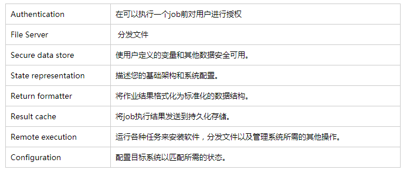
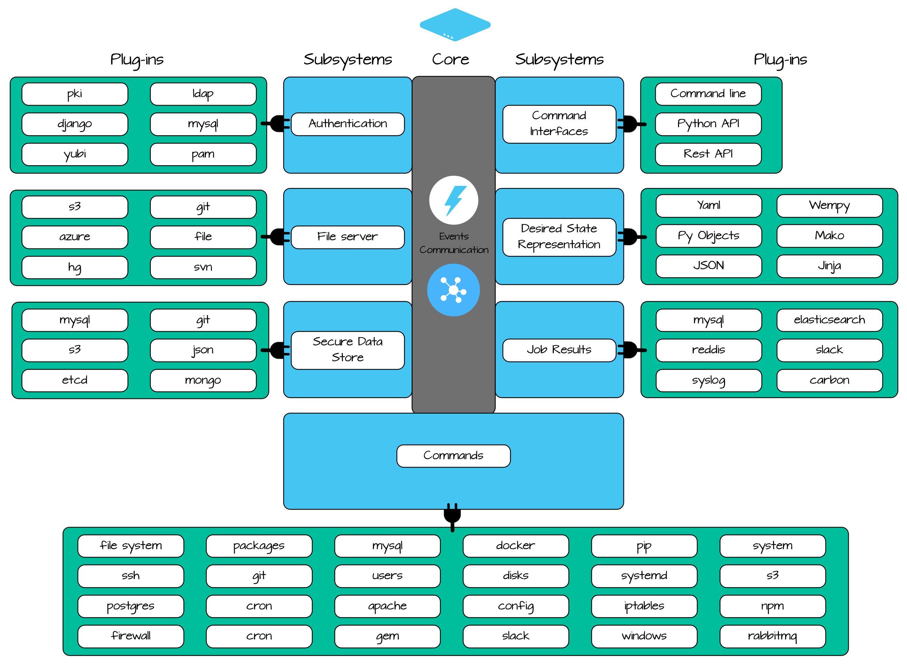
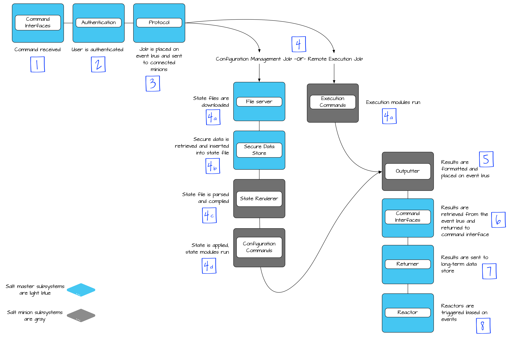
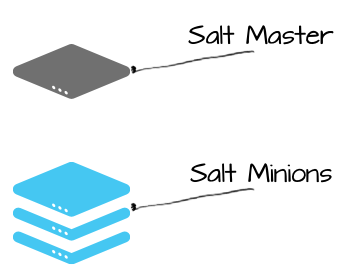
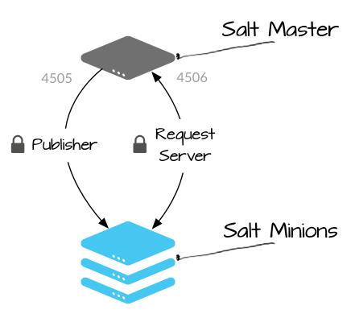
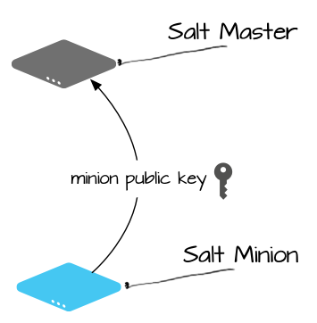
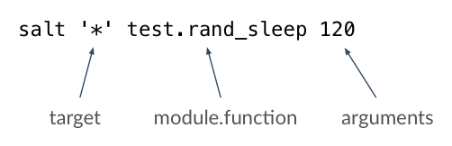

# 02-1.Understanding SaltStack-理解运行原理
1. [Salt 处理事物的方式](#Salt处理事物的方式)
2. Salt 插件
3. 通信与安全
4. 远程执行
5. state状态系统
6. RUNNERS运行器
7. [系统数据](#系统数据)
8. [Python](#python)

# Salt处理事物的方式
您可以通过观察它的运行方式来了解Salt的工作原理。 也就是说，有很多事情是在底层进行的，很难像在控制台上看到数据文件那样有直观的认识。 “入门”教程的这一部分介绍了Salt如何运作、Salt子系统以及Salt的模块化架构是如何让您使用和扩展Salt来管理整个基础架构的。
在深入了解Salt组件的细节之前，了解一些有关Salt实现基础架构管理的方法是很有帮助的。

## 实时通信
所有的Salt minions都会同时接收命令。 这意味着更新10或10000个系统的时间非常相近，并且可以在几秒钟内完成对数千个系统的查询。 Salt方法可以实时查询您的基础设施信息，而不是依赖于数据库。（注意：数据库非常适合存储作业结果，Salt支持超过30个存储作业结果的插件，包括mysql，elasticsearch，syslog，carbon和redis。Salt还支持与许多数据存储对接以提供安全的配置数据。 尽管依赖于当前系统配置的决策，Salt查看静态数据库的行为有点像是在一个房间里，通过给每个人发送询问问题的单独的文本消息，然后将答案写在笔记本中。）

## 拒绝大包大揽
Salt minions自己负责做好大部分的工作。 来自Salt master的通信只是一套轻量级的指令，基本上类似于“如果你是具有这些属性的minion，请用这些参数运行这个命令。”在接收到命令时Salt minions会判断它们是否匹配这些属性。 每个Salt minion都已经在本地存储了他可以执行的所有命令，因此可以立即执行命令并将结果快速返回给Salt master。 Salt master在这个过程中并没有做任何事情，因为minion可以自己做得更好。

## 专为扩展而设计
Salt专为高性能和可扩展性而设计。 Salt的通信系统使用ZeroMQ或raw TCP在Salt master和minions之间建立了一个持久的数据通道，使Salt相对于其他竞争解决方案具有相当的性能优势。 在网络链路上传输的消息使用MessagePack进行高效地序列化。 在内部，Salt使用Python Tornado（由一些非常聪明的开发人员实现）作为一个异步网络库，Salt又在多线程和并发方法实现上进行了调优。
在单个master生产环境中遇到超过10,000个minions的用户并不罕见。目前已知部署的Salt中，最多的有部署超过35,000个minions！ Salt已经证明了其在真实世界的速度和可扩展性。

## 规范化一切
规范化是Salt跨平台管理功能的关键。 无论您的目标是Linux，Windows，MacOS，FreeBSD，Solaris还是AIX，物理硬件或云中，或者您的目标是容器，Salt的命令和状态都是相同的。 Salt负责抽象化每个操作系统、硬件类型和系统工具的细节，以便您可以正确地管理基础架构。

统一的规范还包括了返回的作业结果数据：Salt命令使用一致的数据结构返回作业结果，以方便消费和存储。

## 管理一切
Salt可以在几乎所有Python能运行的地方运行。 对于无法完全管理Python的设备，您可以使用proxy minion系统。 这意味着接入Salt管理的唯一要求是支持任何一个网络协议（即使您自己编写协议！）。 Salt命令被发送到proxy minion服务器，它会将salt调用转换为本地协议，然后将它们发送到真正的目标设备。来自设备的返回数据在被解析后，放入一个Salt统一的数据结构中并返回。

## 自动化一切
Salt的事件驱动基础架构不仅可以让您实现自动化的初始系统配置，还可以让您随时随地自动扩展、修复和执行持续管理。 用户可以使用Salt自动部署和维护复杂的分布式网络应用程序和数据库、自定义应用程序、文件、用户帐户、标准软件包以及云资源等等。

## 可选的程序设计
您可以在不学习编程语言的情况下使用所有的salt功能。 Salt的远程执行功能是CLI命令，State系统则使用YAML来描述系统的所需配置。
您仍然可以采用“infrastructure as code”的方法--Salt有许多工具可以支持这一点，包括提供了一个强大的必备条件管理系统（其中包含命令式和声明式执行）。 Salt不需要您编写Python或Ruby代码来描述您的基础架构，因此可节省很多使用成本。

## 通过模块化系统提供可扩展性
一些管理工具认为它们是可扩展的，因为它们可以支持运行一个外部脚本。而在Salt中，一切都是可扩展的。 正如你将在下一节中所学到的，即使是底层的通信协议也是可以互换的。 Salt有超过20个可扩展的子系统，这意味着如果Salt可以完成它，那么你可以自定义它是如何完成的。

Salt可以快速采用新技术，并在开发新应用程序时管理新应用程序，并且您永远不会被别人的决定卡在哪个是管理基础架构的最佳方式。

## 插件
在下一节中，我们将学习Salt插件以及为什么他们对Salt使用方式如此重要。


# Salt 插件
没有关于插件的讨论，关于Salt使用方式的任何讨论都是不完整的。 理解插件和Salt的可插拔架构通常是将Salt调查员变成Salt福音传播者的“eureka”时刻（古希腊语，意思为I found it!）。
基本的解释是：Salt的核心框架提供了高速通信和事件总线。 此框架连接并验证您的托管系统，并为这些系统提供了一种发送通知的方式。
在这个核心框架的基础之上，Salt的其余特性被公开为一组松散耦合的可插拔子系统。

## 可插拔的子系统
Salt包含超过20个可插拔子系统，但大多数用户只对少数用于直接管理系统的感兴趣。
下表包含Salt中一些常见子系统的列表：



为了说明，下图显示了几个常用子系统以及每个子系统最常用的插件。



此图只显示少数可用的子系统和插件，但它应该能让您了解Salt的通用体系架构。

## 在job运行过程中使用到的子系统
在作业运行时，会调用多个Salt子系统以处理作业。 下图显示了典型的state状态运行或远程执行作业的子系统流程：



在每个步骤中，子系统都将其工作委托给配置的插件。 例如，步骤7中的作业返回者插件可能是30个插件之一，包括MySQL，Redis或根本不配置（作业返回插件也可以在步骤4之后直接在受管系统上运行）。在每一步中，都有许多插件可用于执行任务，从而产生数百种可能的Salt配置和工作流程。

## 插件？模块？
在Salt中，插件通过它们的Python模块名称而为人所知。 由于每个插件都是Python模块，因此大多数时候它们都简单地称为模块，或者更准确地说，是Salt子系统模块（例如Salt认证模块、Salt文件服务器模块等）。

只要你明白每个Salt模块实际上都是一个插件，它是扩展了Salt中众多子系统的插件中的一个，你就可以很好地理解这种关系。

## 灵活性
这种灵活性使得salt成为一个非常强大且可定制的工具，但是当您了解该工具时，它也会让您难以给问题一个标准的回答。

下面让我们尝试下采用“technically accurate”的方法，并回答一些关于Salt的常见问题：

1）你是如何开始执行一个Salt job？
可以调用Python的任何接口，REST API，命令行或使用Salt的内置调度程序。

2）salt是怎么对作业结果进行格式化管理的？
YAML，JSON，纯文本，Python数据结构和其他几种格式，你可以随时用一个参数改变格式。

3）Salt用于配置声明的格式是什么？
根据您的使用情况可以选择15种支持的格式之一，您也可以选择模板语言。 格式是以每个文件为基础指定的，因此您可以同时使用多种格式。

4）作业的结果存储在哪里？
几乎有任何你想要的存储插件，你有30个选项！

除了让你在谈话中感觉到非常烦人之外，用这种方式回答问题的确可以准备说明Salt的管理方法。
你了解自己的基础设施，并且在当今复杂的环境中，也并没有一种最好的方法可以做任何事情。

尽管如此，不要另这些让你担心，Salt提供了大部分Salt用户适用的出色的默认设置。 关键的一点是，Salt的各种灵活性就在那里，在你需要的时候和地方使用他就好了。

## Salt组件
借助Salt的插件子系统的新知识，希望您已经开始理解，每个Salt组件实际上都是Salt中的一个插件子系统，并带有相应的插件。
Salt grains? Salt pillar? Salt runners?  都是易于扩展的可插入子系统。

## 虚拟模块
我们在这里已经介绍了很多，但还有一件与模块有关的事我们需要解决。 还记得早些时候我们解释Salt如何抽象操作系统的基础细节的吗？ Salt实现这种抽象的一种方式就是使用虚拟模块。

某些管理任务在操作系统之间的执行方式是如此不同，以至于在编写插件时，它们之间可以重复使用的代码非常少。

例如，Debian系统上的软件包管理是使用名为aptpkg的执行模块完成的。 在Redhat上，它使用称为yumpkg的执行模块完成（出于应该显而易见的原因）。 如果你已经使用过Salt，那么你会知道salt会调用pkg远程执行模块进行包管理，并且它可以在所有操作系统上运行。

为了启用这种类型的抽象，Salt使用虚拟模块名称来加载这些类型的模块。 aptpkg模块包含的说明基本上是说“如果您是Debian系统，请将此模块作为pkg加载。 否则，请不要加载这个！“对于Redhat或CentOS的检查，yumpkg中会出现类似的代码。 通过这种方式，可以存在多个模块来执行相同的任务，但只有一个模块被加载为虚拟名称。

在阅读模块文档时请记住这一点，因为您经常需要阅读非虚拟模块的文档以了解其行为。 您可以在Salt模块内搜索__virtualname__以查找Salt在加载该模块时使用的名称。


# 通信与安全
本节介绍了Salt通信模型以及身份验证和安全性的基本概述。

## 架构模型
Salt使用server-agent通信模型（虽然它也能作为独立的单服务器端管理实用工具运行良好，并且还提供了通过SSH运行无代理程序的功能）。 服务器端组件被称为Salt master，agent被称为Salt minion。



Salt master主要负责向Salt minions发送命令，然后聚合并显示这些命令的结果。 一个Salt master可以管理数千个系统。

## 通信模型
Salt使用发布 - 订阅模式与受管系统进行通信。 连接由Salt minion发起，这意味着你不需要在这些系统上打开任何传入端口（从而减少攻击向量）。 Salt master使用端口4505和4506，必须打开端口才能接收访问连接。



**Publisher**
（端口4505）所有Salt  minions都需要建立一个持续连接到他们收听消息的发布者端口。 命令是通过此端口异步发送给所有连接，这使命令可以在大量系统上同时执行。

**Request Server**
（端口4506）Salt minions根据需要连接到请求服务器，将结果发送给Salt master，并安全地获取请求的文件或与特定minion相关的数据值（称为Salt pillar）。 连接到这个端口的连接在Salt master和Salt minion之间是1：1（不是异步）。

## Salt minion认证
当minion第一次启动时，它会在网络中搜索一个名为salt的系统（尽管这可以很容易地更改为IP或不同的主机名）。 当发现时，minion发起握手，然后将公钥发送给Salt master。



在初始连接之后，Salt minions的公钥存储在服务器上，并且必须使用salt-key命令（或通过某种自动机制）在Salt master上接受。 这可能是让新用户混淆的原因，因为Salt不会提供解密消息所需的安全密钥，直到Salt minions的公钥被接受（这意味着Salt minions在被接受其密钥之前不会运行任何命令）。

在minion密钥被接受后，Salt主机会返回其公钥以及旋转的AES密钥，该密钥用于加密和解密由Salt master发送的消息。 返回的AES密钥使用Salt minion最初发送的公钥进行加密，因此只能由该Salt minion解密。

## 安全通信
Salt master和Salt minion之间的所有进一步通信都使用AES密钥进行加密。 AES加密密钥根据最新公认的TLS版本使用明确的初始化向量和CBC块链接算法。

## 更换安全密钥
AES密钥用于加密Salt master发送给Salt minion的作业，并加密与Salt master文件服务器的连接。 每次Salt master重新启动或者每次使用salt-key命令删除Salt minion密钥时，都会生成并使用新密钥。

在密钥发生轮换后，所有的Salt minions必须重新认证才能收到更新后的钥匙。 这使得AES密钥可以在不中断连接的情况下更换。

## 加密通信频道
Salt master和Salt minion之间的公开通信使用 rotaing AES密钥进行加密。 Salt master和Salt minion之间的直接通信则为每个会话使用一个唯一的AES密钥进行加密。

例如，已发布的作业使用rotaing AES密钥进行加密，而使用Salt pillar管理的数据数据则使用每个Salt minion和会话的唯一AES密钥进行加密。

## 用户访问控制
在向minions发送命令之前，Salt会对发布者的ACL权限执行一些内部检查，以确保执行命令的用户具有正确的权限。 如果用户有权针对指定的目标运行指定的命令，则发送该命令。 如果不是，则返回错误。 Salt还会返回一个预计会响应命令行接口的minions列表，以便知道需要等待返回结果的时间。

# 远程执行
在《SaltStack Fundamentals-基础知识》一章中有一个专门的段落是介绍Salt remote execution功能的，可以参考。
Salt从一开始就是设计为一个远程执行工具，在Salt的其他子系统大量使用了远程执行的功能。

+ Salt命令旨在支持跨OS和跨平台使用。 一个salt '*' pkg.install git 的命令可以在基于目标平台的封装下使用yum、apt、pacman或Salt的windows包存储库去执行具体的操作。 一个命令，通用于许多系统。
+ 所有Salt命令都以一致的数据结构返回作业结果。 这就可以很容易地对作业结果进行检查或将它们存储在数据库中。
+ 所有目标系统都可以同时开始运行一项作业，因为它们几乎是同时接收到命令的。
+ Salt使用一个包含了数百个Python模块的库来执行远程管理，并且您可以轻松添加自己的模块（或者更好的是，将它们提供给项目！）。 任何可以使用Python、shell命令或几乎任何其他接口访问的应用程序或服务都可以作为Salt中的执行模块公开。

使用salt命令行界面可以访问Salt远程执行系统。 让我们从Salt的命令行界面发出一个简单命令，并通过Salt系统追踪它：
``` bash
salt '*' test.rand_sleep 120
```
根据我们对Salt通信系统的了解，以下是会发生的情况：

+ 该命令通过发布者的端口发送给了所有连接上的minions。
+ 每个minion检查命令，根据命令设定的目标对自身进行评估，并决定是否应该执行命令。
+ 匹配上的目标系统运行该命令，然后将作业结果返回给请求服务器。

让我们深入研究一下当命令运行时在minion上发生了什么。
首先，每个命令都分离成一个单独的工作线程，因此一个Salt minion可以同时处理多个工作。
但是Salt minion如何将test.rand_sleep 120命令变为行动的？ 当然是通过Salt Execution执行模块！
所有用于管理系统的命令都由Salt执行模块提供的。 这些模块是Salt的实际工作内容，一旦您了解了有关其工作方式的一些信息，便可轻松使用。

当Salt minion接收到一个命令时，它只需找到正确的模块（在本例中为test模块），然后调用相应的函数（rand_sleep），提供必要的参数（120）。 从这个意义上讲，你可以把Salt看作是Python功能的一个抽象层。



使用远程执行功能时，您需要找出来Salt执行模块的完整列表，仔细检查一下您要使用的功能或工具是不是已经实现为可直接使用的功能模块了。利用已有模块进行开发，会事倍功倍。模块文档中也有很多例子，并且很容易调用。

# state状态系统
在《SaltStack Configuration Management-配置管理》中专门介绍Salt State系统是如何使用的，可以参考。

Salt状态系统在远程执行系统之后不久就出现了，它大量利用了远程执行系统。 Salt状态模块与Salt远程执行模块非常相似，但也有一个重要区别。 状态模块包含用于查看系统是否已处于正确状态的逻辑。 事实上，在作出这一决定后，state模块通常只需调用远程执行模块来完成这项工作。

+ 状态模块的命令设计旨在可以良好的支持跨OS和跨平台。
+ 所有状态模块命令都以一个一致的数据结构返回作业结果。 这让我们可以很容易地检查结果或将它们存储在数据库中。
+ 所有目标系统都可以同时运行一项作业，因为它们都可以同时接收命令。
+ Salt使用一个包含了数百个Python模块的库来执行配置管理，并且您还可以轻松添加您自己的（或者更好的是，将它们提供给项目！）。 可以使用Python，Shell命令或几乎任何其他接口访问的任何应用程序或服务都可以使用Salt中的状态模块进行配置。

**状态系统的流程控制**

状态系统和远程执行系统之间的主要区别在于状态系统内的流程控制。 Salt提供了一些特殊的命令，让您可以定义一个作业任务中的依赖关系，重用代码，分析失败，控制流，并利用到变量和模板技术。

# RUNNERS运行器
Runner子系统提供了一个允许在Salt master上运行命令的Salt模块（Execution和State模块都是在每个minion上运行的，而不是在Salt master上）。

Runners可以实现列出job运行状态，实时查看事件信息，管理Salt的文件服务器，查看Salt minion数据，发送唤醒信号给minions，调用webhook并触发其他http请求等等。

+ 使用salt-run命令行命令来调用Runners。 他们不需要设定目标target，因为目标只能是执行这个命令的Salt master。
+ 将参数传递给Salt runners的语法与用于将参数传递给Salt执行模块的语法相同。

**编排Runner**

关于编排运行器（ORCHESTRATE RUNNER），有自己独立的一个章节部分进行说明，因为它提供了Salt的核心功能之一：能够按照定义的顺序运行命令并跨多个应用程序应用配置。
例如，使用编排运行器，您可以使用状态系统的全部功能（includes，requisites，失败时分支，依赖关系，有序执行等）配置多个系统。 当您准备好探索此功能时，这将在Salt with Orchestration with Salt教程中深入介绍。

# 系统数据
本节讨论系统数据的两个主要方面：获取有关系统的数据以及将数据提供给指定系统。 Salt分别提供两个不同的子系统执行这些任务：Salt grains 和 Salt pillar。

本节还解释了称为Salt mine的第三个组件，该组件用于将数据从一个minion服务器推送到master服务器上的共享数据存储区，以供所有minions服务器访问。

## GRAINS
Grains用于获取有关您的系统的数据。 Grains是关于底层操作系统、内存、磁盘和许多其他系统属性的静态信息。

从minion主机运行Grains就开始采集这些系统静态信息，并且周期性地刷新或者通过使用远程执行命令时，Grains不能会自动收集信息。

那么你可以用Grains做什么？

您可以使用Grains执行模块收集清单，Grains执行模块可以列出所有Grains条目，可以用于查找具有特定Grains值的系统等。

Grains也是Targeting系统的一个重要组成部分。 Grains可以被用于匹配目标Salt state状态和Salt pillar数据。

如果你已经阅读了前面关于插件的部分，你已经知道Grains是如何工作的。 Grains子系统有几个Salt Grains模块（又名插件），它们运行在minion上用于采集信息并填充Grains字典。

由于Grains比远程执行模块简单，因此每个Grains模块都直接包含了用于跨OS收集Grains数据的逻辑（而不是使用的多个模块和\__virtualname__）。

## SALT PILLAR
Pillar用于将数据传送到您受管理的系统。考虑到即便配置一个简单系统时也需要使用到很多不同的定制数据：用户名、服务URL、首选安装路径、端口以及非默认应用程序设置等等。通常，这些值对于每个系统或系统角色（Web，数据库等）都是不同的。

Pillar可以让你定义这些数据值，然后使用目标匹配逻辑将它们分配给一个或多个minions。接下来就可以使用变量将这些值插入到指定的Salt状态文件中去了。

Pillar数据会使用目标minion的公钥进行加密，并通过安全通道发送，所以Salt Pillar也非常适合安全地分发数据，如密码和ssh密钥，因为它只能由目标minion解密。Salt Pillar数据永远不会被写入到minion的磁盘上去。

默认的Salt Pillar模块使用YAML文件定义Pillar，尽管有超过30个Pillar模块（又名插件）可用于支持各种各样的后端。流行的选项包括Mongo和Redis，它们都是用来存储结构化数据的。但许多用户坚持使用YAML文件，但会使用专用的git repo来管理和分发Pillar数据。

## SALT MINE
Salt mine被用来在Salt minions之间分享数据。 例如，如果您设置了共享数据库，则可以配置数据库服务器上正在运行的Salt minion以将其IP地址自动推送到Salt mine。 这比将其存储在Salt state或Salt pillar中且需要手动更新维护的方法要更好。
通过在Salt mine中维护这些共享数据，稍后当您设置需要此值的系统时，您可以直接从Salt状态文件访问Salt mine。

Salt mine非常容易使用，许多用户面临的最大问题是记住并使用它！

# PYTHON
我知道我们之前说过，你不需要能够编写Python或其他代码来使用Salt，这是事实。 然而，在许多情况下，需要能够读取Python，或者至少是Python函数文档，这要比编写Python容易得多。
本节将帮助您更好地理解Salt如何工作的Python基础知识。

## 模块
在Salt中，每个子系统插件都是一个Python模块。 在Salt中，您可以将模块视为管理应用程序（mysql，docker）、系统组件（磁盘，文件）或与外部系统（gitfs）交互的一组函数（命令）。
以下是一些需要了解的知识：

+ 所有模块都位于源代码的salt文件夹中。 每个子系统有一个单独的子目录，每个模块都是以.py结尾的单独文件。
+ 模块名称的格式为salt.subsystem.module。 该命名空间在文档中可见，因此您可以快速判断您正在查看哪种类型的子系统模块。 有一点困惑的是：执行模块是以salt.module开头的，因为它们是Salt的初始版本中的第一个也是唯一的模块（当时间旅行发明时，我们应该用salt.execution来替换它们）。
+ 根据使用需要模块中可以包含尽可能多或少的功能。 像文件执行模块（salt.modules.file）具有很多功能，因为文件管理是一件大事。 而uwsgi stats server执行模块（salt.modules.uwsgi）就只有一个功能函数。

## 功能函数
如果你理解了上一节关于模块的内容，那么功能函数就更容易了。 您可以将功能视为模块中的特定命令，您可以调用该模块来管理和配置系统。 例如，salt.modules.pkg.install，salt.modules.network.interfaces和salt.modules.user.add都是常用的执行功能。 通常可以通过打开模块文档并查看函数名称来确定要调用的函数。

## 参数
参数比较复杂一些，特别是如果你不熟悉关键字参数，参数语法就是你开始使用Salt的时候通常会遇到的问题。
参数在远程执行和状态之间有所不同，因此我们将分别介绍每个模块的参数。

### 远程执行模块参数
当在命令行上调用Salt时，执行参数作为附加值传递，或者只是一个值，或者作为argument=value形式。 所需的值通常需要以特定的顺序传递，因为该值仅由空格分隔，而具有默认值的可选参数作为argument=value传递。

例如，查看Salt文档中显示的user.add函数签名（user是一个虚拟模块，因此我们应该查看useradd的文档）：
``` PYTHON
salt.modules.useradd.add(name, uid=None, gid=None, groups=None, home=None,
shell=None, unique=True, system=False, fullname='', roomnumber='',
workphone='', homephone='', createhome=True, loginclass=None)
```
从上面的函数定义可以看到，调用此模块时，名称是必需的，您可以看到并没有提供这个参数的默认值。 其余参数将使用列出的值，除非您将一个不同的值作为重写值传递进来。
以下示例创建一个名为Fred的用户并设置为使用其他shell程序：
``` bash
salt '*' user.add fred shell=/bin/zsh
```
更多的例子。
常规参数和关键字参数（通常缩写为args和kwargs）是您遇到的最常见的类型。
这是一个传递一个arg和三个kwargs的例子：
``` bash
salt '*' network.connect google-public-dns-a.google.com port=53 proto=udp timeout=3
```
传递两个参数和一个kwarg：
``` bash
salt '*' cp.get_file salt://vimrc /etc/vimrc gzip=5
```
有几个执行模块可以接受列表参数，这些列表按如下方式传递：
``` bash
`salt ns1 pkg.install pkgs=['bind9','bind9-docs','bind-utils']`
```
有些甚至会列出字典清单：
``` bash
`salt '*' pkg.install sources='[{"foo": "salt://foo.deb"},{"bar": "salt://bar.deb"}]'`
```
### state状态模块参数
使用YAML语法在状态文件中调用状态函数。 YAML语法非常适合表示数据类型，所以您可能会发现，具有复杂数据类型的调用函数在state状态中更容易实现。 要查看用户在state状态中的添加方式，请查看salt.states.user.present函数：
``` PYTHON
salt.states.user.present(name, uid=None, gid=None, gid_from_name=False,
groups=None, optional_groups=None, remove_groups=True, home=None,
createhome=True, password=None, hash_password=False, enforce_password=True,
empty_password=False, shell=None, unique=True, system=False, fullname=None,
roomnumber=None, workphone=None, homephone=None, loginclass=None, date=None,
mindays=None, maxdays=None, inactdays=None, warndays=None, expire=None,
win_homedrive=None, win_profile=None, win_logonscript=None,
win_description=None)
```
尽管有很多参数，但在YAML中使用关键字参数调用这个函数可以很容易：
``` YAML
a state example that calls user.present:
  user.present:
    - name: fred
    - shell: /bin/zsh
```
** USER.ADD VS USER.PRESENT **

由于状态函数是有状态的，salt.states.user.present函数会首先检查用户是否已经存在，如果不存在，则创建用户以满足“present”状态。
salt.modules.user.add执行函数简单地添加用户，如果用户已经存在，这可能会导致错误。

使用YAML也很容易定义列表参数：
``` YAML
install bind packages:
  pkg.installed:
    - pkgs:
      - bind9
      - bind9-docs
      - bind-utils
```
定义字典列表也要比在命令行上更容易：
``` YAML
Install some packages using other sources:
  pkg.installed:
    - name: mypkgs
    - sources:
      - foo:salt://foo.deb
      - bar:http://somesite.org/bar.deb
```
一个同时适用于远程执行和状态函数的提示：并不是所有可用的参数都列在函数签名中。有少数几个执行函数只是充当其他Python API或接口的包装器，因此它们只传递您提供的任何参数。 这些额外的参数通常记录在签名下方，但有时您需要检查代码或相应的接口，以确切了解支持的内容。

这些知识应该让你足够了解远程执行和状态子系统是如何使用Python来启动的了。
