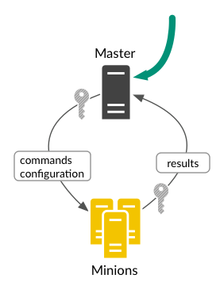
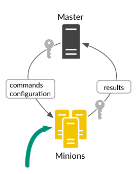
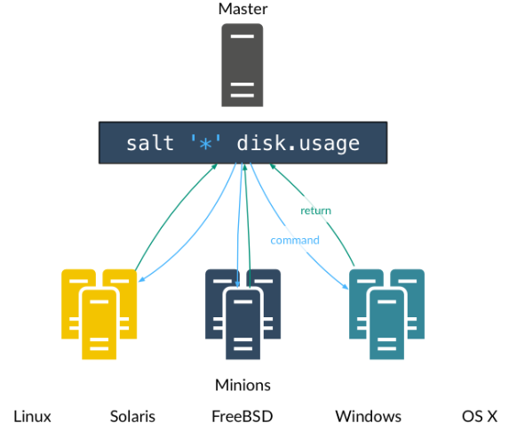
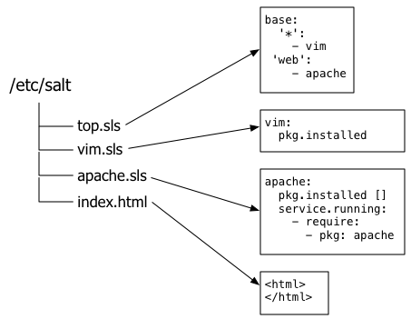
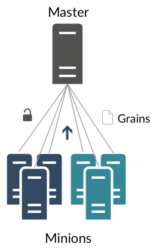
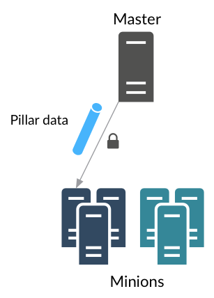
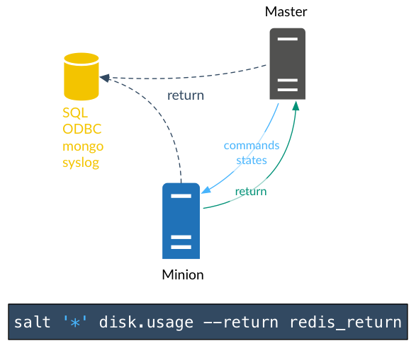
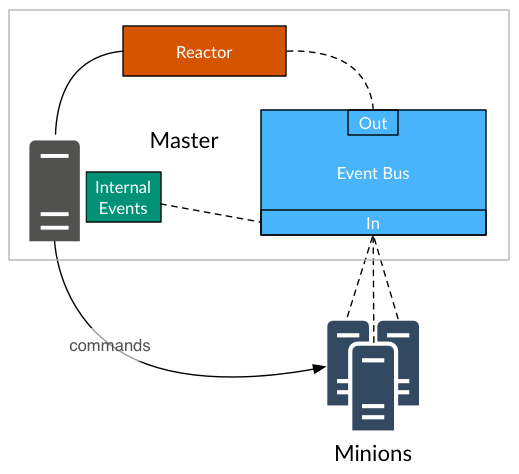
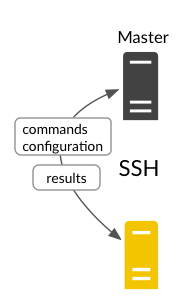

# 02-6.SaltStack Compoents & Flexibity & Speed - SaltStack组件与灵活性以及速度
1. [SaltStack的组件](#saltstack的组件)
2. [SaltStack的灵活性](#saltstack的灵活性)
3. [SaltStack的速度](#saltstack的速度)

# SaltStack组件
您将在本教程的其他章节中获得对这些组件的更好的介绍，但是对于每个组件在SaltStack中扮演的角色掌握一般概念也是有帮助的。

|组件|拓朴图|描述|
| :- | :-: | :- |
|Salt Master||中心管理系统。此系统用于将命令和配置发送到在受管系统上运行的Salt minion。|
|Salt Minions||被管理的系统。该系统运行Salt minion，它从Salt master接收命令和配置。|
|Execution Modules||从命令行针对一个或多个受管系统执行临时命令。 对以下管理场景有帮助：实时监控，状态和盘点；一次性命令和脚本；部署关键更新。|
|Formulas (States)||一种系统配置的声明性或命令式表示。|
|Grains||系统变量。 Grains是有关底层受管系统的静态信息，包括操作系统，内存和许多其他系统属性。 您还可以为任何系统定义自定义grains。|
|Pillar||用户定义的变量。 这些安全变量被定义并存储在Salt Master中，然后使用目标“分配”给一个或多个minions。 pilla数据存储诸如端口，文件路径、配置参数和密码之类的值。|
|Top File||将formulas和pilla数据与Salt minions匹配。|
|Runners||在Salt master上执行的模块，用于执行支持任务。 Salt runners报告作业状态、连接状态、从外部API读取数据，查询连接的Salt minions等。例如，Orchestrate运行器协调跨多个系统的配置部署。|
|Returners||将Salt minions返回的数据发送到另一个系统，例如数据库。 Salt Returners可以在Salt minion或Salt master上运行。|
|Reactor||在SaltStack环境中发生特定事件时触发相应的响应。|
|Salt Cloud/Salt Virt||在云提供商/虚拟机平台上运行的系统，便于立即对其进行管理。|
|Salt SSH||在没有部署Salt minion的系统上通过SSH运行Salt命令。|

# SaltStack的灵活性
每个管理工具及其Git分支都声称是灵活的，但是当我们在SaltStack上说灵活时，我们的意思是整个管理方法的灵活性。

SaltStack可以实现遵循最流行的系统管理模型：
- 代理和服务器
- 仅代理
- 仅服务器
- 在同一环境中的任何或所有上述内容

## AGENT AND SERVER
配置管理的标准模型。 管理服务器向在在大量系统上运行的代理agent发送命令和配置，并将结果返回给服务器。

## AGENT-ONLY
如果您因为不想设置所有“额外的东西”而避免使用管理工具，那么这可能就是您的模型。 无论服务器是否参与，Salt代理都可以执行管理任务。

关于这个模型最好的事情是它已经内置了; 如果您不想使用管理服务器，则不配置服务器端即可。 您可以在此模型与C/S模型之间来回切换，也可以将它们一起使用。

## SERVER-ONLY (AGENTLESS)
可以使用SSH而不是Salt代理在远程系统上执行Salt命令。 比如使用Salt代理配置所有Web服务器，但通过SSH在数据库服务器上执行临时管理任务。 这完全取决于你。

## 没有适用所有场景的模型
本入门指南的初始部分是使用C/S模型演示SaltStack，以简化操作。 如果您计划使用不同的方法，请不要让它妨碍到您。 每个管理模型之间的主要区别是您使用的SaltStack可执行文件及其调用方式。 在工作方面，SaltStack功能在每个模型中实际上基本相同。

## 命令和声明配置管理
SaltStack支持两种定义系统配置的主要方法。 使用SaltStack强大的先决条件检查系统以遵循声明性方法，或者使用SaltStacks内置的命令有序执行。

# SaltStack的速度
在SaltStack中，速度不是副产品，而是设计目标。 SaltStack是一种极其快速，轻量级的通信总线，可为远程执行引擎提供基础。 SaltStack现在提供编排、配置管理、事件反应器、云配置等，所有这些都是围绕SaltStack高速通信总线构建的。

Salt master与所有受管系统建立持久连接，并使用轻量级协议实现跨数千个受管系统的实时通信。

SaltStack提供了一个可插拔的架构，可以让您几乎扩展系统的任何部分。 例如，您可以轻松添加自定义执行模块，将作业结果发送到新的系统，并使用信标监视受管系统的任何部分。
