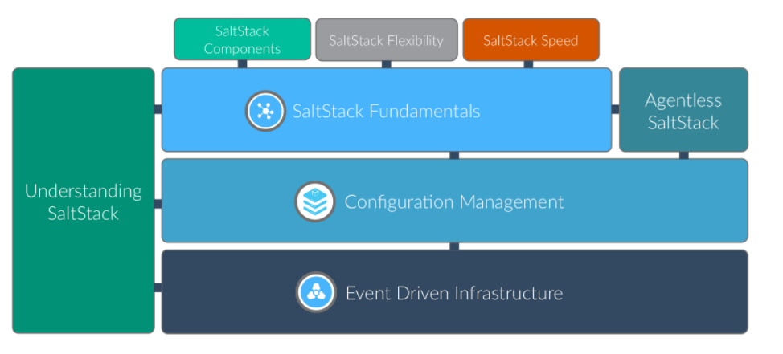

# SaltStack-Chinese-Manual
This article is based on the translation of the official English documentation for SaltStack.

https://docs.saltstack.com/en/latest/contents.html

# Introduction to Salt
+The 30 second summary
+Simplicity
+Parallel execution
+Builds on proven technology
+Python client interface
+Fast, flexible, scalable
+Open
+Salt Community
+Mailing List
+IRC
+Follow on Github
+Blogs
+Example Salt States
+Follow on ohloh
+Other community links
+Hack the Source
# Installation
+Quick Install
Platform-specific Installation Instructions
Initial Configuration
Additional Installation Guides
Dependencies
Optional Dependencies
Upgrading Salt
Building Packages using Salt Pack
Configuring Salt
Configuring the Salt Master
Configuring the Salt Minion
Configuring the Salt Proxy Minion
Configuration file examples
Minion Blackout Configuration
Access Control System
Job Management
Managing the Job Cache
Storing Job Results in an External System
Logging
External Logging Handlers
salt.log.handlers.fluent_mod
salt.log.handlers.log4mongo_mod
salt.log.handlers.logstash_mod
salt.log.handlers.sentry_mod
Salt File Server
Git Fileserver Backend Walkthrough
MinionFS Backend Walkthrough
Salt Package Manager
Storing Data in Other Databases
Running the Salt Master/Minion as an Unprivileged User
Using cron with Salt
Use cron to initiate a highstate
Hardening Salt
Security disclosure policy
Salt Transport
Master Tops System
Returners
Renderers
Using Salt
Grains
Storing Static Data in the Pillar
Targeting Minions
The Salt Mine
Runners
Salt Engines
Understanding YAML
Understanding Jinja
Tutorials Index
Troubleshooting
Frequently Asked Questions
Salt Best Practices
Remote Execution
Remote execution tutorial
Running Commands on Salt Minions
Writing Execution Modules
Executors
Configuration Management
How Do I Use Salt States?
States tutorial, part 1 - Basic Usage
States tutorial, part 2 - More Complex States, Requisites
States tutorial, part 3 - Templating, Includes, Extends
States tutorial, part 4
State System Reference
Utility Modules - Code Reuse in Custom Modules
Events & Reactor
Event System
Beacons
Reactor System
Orchestration
Orchestrate Runner
Solaris
Solaris-specific Behaviour
Salt SSH
Getting Started
Salt SSH Roster
Deploy ssh key for salt-ssh
Calling Salt SSH
States Via Salt SSH
Targeting with Salt SSH
Configuring Salt SSH
Running Salt SSH as non-root user
Define CLI Options with Saltfile
Debugging salt-ssh
Thorium Complex Reactor
Starting the Thorium Engine
Thorium Modules
Writing Thorium Formulas
The Thorium Register
Salt Cloud
Configuration
Configuration Inheritance
QuickStart
Using Salt Cloud
Core Configuration
Windows Configuration
Cloud Provider Specifics
Miscellaneous Options
Troubleshooting Steps
Extending Salt Cloud
Using Salt Cloud from Salt
Feature Comparison
Tutorials
Salt Proxy Minion
New in 2017.7.0
New in 2016.11.0
New in 2016.3
New in 2015.8.2
New in 2015.8
Getting Started
The __proxyenabled__ directive
SSH Proxymodules
Network Automation
New in Carbon (2016.11)
NAPALM
JUNOS
Salt Virt
Salt Virt Tutorial
The Salt Virt Runner
Based on Live State Data
Deploy from Network or Disk
Command Line Reference
salt-call
salt
salt-cloud
salt-cp
salt-extend
salt-key
salt-master
salt-minion
salt-proxy
salt-run
salt-ssh
salt-syndic
salt-unity
salt-api
spm
Pillars
Master Tops
Salt Module Reference
auth modules
beacon modules
Cache Modules
cloud modules
engine modules
executors modules
fileserver modules
grains modules
execution modules
netapi modules
output modules
pillar modules
proxy modules
queue modules
renderer modules
returner modules
roster modules
runner modules
sdb modules
serializer modules
state modules
thorium modules
master tops modules
wheel modules
APIs
Python client API
netapi modules
Architecture
High Availability Features in Salt
Salt Syndic
Using Salt at scale
Multi Master Tutorial
Multi-Master-PKI Tutorial With Failover
Minion Data Cache
Pluggable Data Cache
Configuring the Minion Data Cache
Slots
Execution functions
Windows
Windows Software Repository
Windows-specific Behaviour
Developing Salt
Overview
Salt Client
Salt Master
Salt Minion
A Note on ClearFuncs vs. AESFuncs
Contributing
Deprecating Code
Dunder Dictionaries
External Pillars
Installing Salt for development
GitHub Labels and Milestones
Logging Internals
Modular Systems
Package Providers
Pull Requests
Reporting Bugs
Salt Topology
Translating Documentation
Developing Salt Tutorial
Salt Extend
Salt's Test Suite
Integration Tests
Writing Unit Tests
raet
SaltStack Git Policy
Salt Conventions
Salt code and internals
Salt Community Projects
Salt's Test Suite: An Introduction
Release Notes
Latest Branch Release
Previous Releases
Venafi Tools for Salt
Introduction
Example Usage
Runner Functions
Glossary