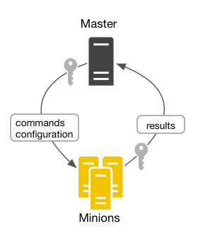
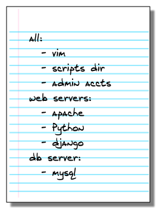
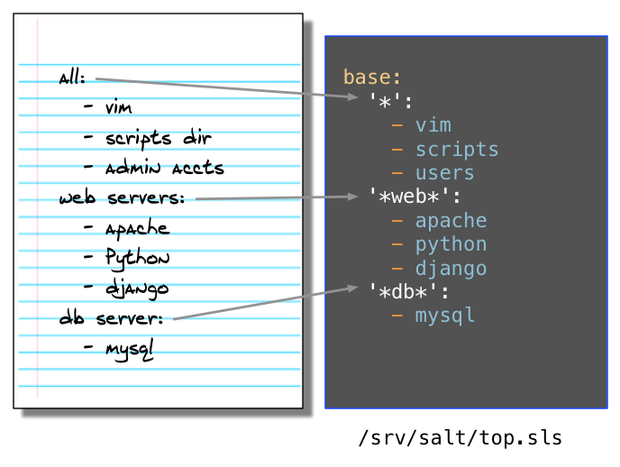

# 02-2.SaltStack Fundamentals-基础知识
1. [Demo环境搭建](#demo环境搭建)
2. [安装SaltStack](#安装saltstack)
3. [执行管理命令](#执行管理命令)
4. [选择目标主机](#选择目标主机)
5. [创建一个Salt State状态配置文件](#创建一个salt-state状态配置文件)
6. [创建一个top file文件并应用Salt状态配置](#创建一个top-file文件并应用salt状态配置)

## Demo环境搭建
完成以下配置步骤来设置一个简单的SaltStack环境。
1. 安装VirtualBox
2. 安装Vagrant
Vagrant是为所有人设计的，作为创建虚拟环境的最简单快捷的方式！
我们这里选择使用windows版本作为示例。
3. 下载 https://github.com/UtahDave/salt-vagrant-demo ，你可以直接从GitHub使用git或下载项目的zip文件
这是一个使用Vagrant实现的Salt Demo环境.
4. 解压缩下载的zip文件，然后打开提取出来的目录的命令提示符：
```bash
cd %homepath%\Downloads\salt-vagrant-demo-master
```
5. 运行vagrant up启动Demo环境
```bash
vagrant up
```
在Vagrant ups（〜10分钟）之后，您又回到了命令提示符下，您就可以继续使用本指南。
Demo环境将使用ubuntu-16.04搭建出一个salt master节点和两个minions节点的测试环境。

注：因为需要在线去国外网站下载box镜像文件，往往因为网速问题失败，所以下面第6点所提供的离线安装办法。
看到输出下面这些信息，就意味着已经创建Demo环境成功了：
```bash
.............................................
Processing triggers for libc-bin (2.23-0ubuntu10) ...
Processing triggers for systemd (229-4ubuntu21.2) ...
Processing triggers for ureadahead (0.100.0-19) ...
*  INFO: Running install_ubuntu_stable_post()
*  INFO: Running install_ubuntu_check_services()
*  INFO: Running install_ubuntu_restart_daemons()
*  INFO: Running daemons_running()
*  INFO: Salt installed!
Salt successfully configured and installed!
run_overstate set to false. Not running state.overstate.
run_highstate set to false. Not running state.highstate.
orchestrate is nil. Not running state.orchestrate.

D:\tools\salt-vagrant-demo-master>
```
按下面的方法登录salt master并使用：
```bash
D:\tools\salt-vagrant-demo-master>vagrant ssh master
Welcome to Ubuntu 16.04.4 LTS (GNU/Linux 4.4.0-87-generic x86_64)

* Documentation:  https://help.ubuntu.com
* Management:     https://landscape.canonical.com
* Support:        https://ubuntu.com/advantage

43 packages can be updated.
20 updates are security updates.

vagrant@saltmaster:~$ sudo salt * test.ping
minion2:
    True
minion1:
    True
vagrant@saltmaster:~$
```
在你运行Vagrant之后，Vagrant会在后台创建并启动多个VirtualBox虚拟机。 这些虚拟机会一直运行，直到你关闭它们，所以确保你在完成时运行vagrant halt：
```bash
vagrant halt
```
再次启动它们，运行vagrant up。如果你想重新开始，你可以运行vagrant destroy，然后vagrant up。
常用命令：
```bash
$ vagrant init  # 初始化
$ vagrant up  # 启动虚拟机
$ vagrant halt  # 关闭虚拟机
$ vagrant reload  # 重启虚拟机
$ vagrant ssh  # SSH 至虚拟机
$ vagrant status  # 查看虚拟机运行状态
$ vagrant destroy  # 销毁当前虚拟机
```
6. 赠送一份离线状态下安装和配置vangrant box镜像文件的资源与指南
资源：

下面是从salt-vagrant-demo-master项目中的Vagrantfile文件中截取的前10行代码，可以看到对Vagrant需要使用的os系统和版本的要求：
``` bash
# -*- mode: ruby -*-
# vi: set ft=ruby :

# Vagrantfile API/syntax version. Don't touch unless you know what you're doing!
VAGRANTFILE_API_VERSION = "2"

Vagrant.configure(VAGRANTFILE_API_VERSION) do |config|
  os = "bento/ubuntu-16.04"
  net_ip = "192.168.50"
```
我们可以看到salt-vagrant项目中使用的是bento/ubuntu-16.04镜像文件。该文件请从我提供的网盘下载一份。https://pan.baidu.com/s/11AhT4t7radNYsvuEkT1Cgw 。因为这个镜像文件本身就是公网开源免费使用的资源，所以这里放在网盘上提供也不涉及什么侵权之说。

在salt-vagrant-demo-master中创建一个子目录bento，并将ubuntu-16.04-virtualbox.box文件放进去。然后执行下面命令添加镜像并命名为ubuntu-16.04。
```bash
D:\tools\salt-vagrant-demo-master>vagrant  box  add  bento/ubuntu-16.04  file:///d:/tools/salt-vagrant-demo-master/bento/ubuntu-16.04-virtualbox.box
==> box: Box file was not detected as metadata. Adding it directly...
==> box: Adding box 'bento/ubuntu-16.04' (v0) for provider:
    box: Unpacking necessary files from: file:///d:/tools/salt-vagrant-demo-mast
er/bento/ubuntu-16.04-virtualbox.box
    box: Progress: 100% (Rate: 66.0M/s, Estimated time remaining: --:--:--)
==> box: Successfully added box 'bento/ubuntu-16.04' (v0) for 'virtualbox'!

D:\tools\salt-vagrant-demo-master>
```
注意：如果你是 windows 用户，路径形式差不多是这样：file:///c:/users/jellybool/downloads/virtualbox.box 。
手动添加box的操作方法参考：https://zhuanlan.zhihu.com/p/25338468

查看已经添加好的镜像文件：
```bash
D:\tools\salt-vagrant-demo-master>vagrant box list
bento/ubuntu-16.04 (virtualbox, 0)
```
使用Vagrant并运行了salt-vagrant-demo-master项目提供的Demo环境后，可以在自己的windows任务管理器中看到类似下面的3个进程：


# 安装SaltStack
## 安装
您可以使用包管理器直接从源代码安装SaltStack，也可以使用bootstrap脚本安装SaltStack。 SaltStack还提供专用工具来创建机器并在公共云和私有云（salt-cloud和salt-virt）上安装Salt。 我们不会在这里介绍这些工具，但是只要知道一旦接入到一个salt管理系统，SaltStack就可以在物理，云和虚拟资源之间使用相同的功能。

如果您使用前一节中链接的Salt Vagrant项目，则已经安装了SaltStack，并且已经接受了到每个minion的连接。 您可以在下面的接受连接中完成任务，以确认您的minions已连接。

如果您使用不同的环境，安装SaltStack的最简单方法是使用bootstrap脚本。 该脚本可以在大多数操作系统上通过简单的几个命令来安装SaltStack。

## 接受连接
Salt master和Salt minion之间的每个连接都使用加密密钥进行管理和保护。 安装完成后，每个Salt 将其公钥发送给Salt master，并等待被接受。 在系统可以从Salt主机接收到命令之前，必须要salt master先接受salt minion密钥。

在命令提示符下，cd进入vagrant-demo-master目录并运行以下命令登录到您的Salt主机：
``` bash
vagrant ssh master
```
+ 注意Salt master的管理命令需要系统root权限才能执行，需要在执行命令时使用sudo或直接切换为root用户。

## 查看所有的密钥
```bash
vagrant@saltmaster:~$ sudo salt-key --list-all
Accepted Keys:
minion1
minion2
Denied Keys:
Unaccepted Keys:
Rejected Keys:
vagrant@saltmaster:~$
```
## 接受一个指定密钥
```bash
salt-key --accept=<key>
```
## 接受所有密钥
```bash
salt-key --accept-all
```
## 从Salt master向minions发送一个命令
```bash
vagrant@saltmaster:~$ sudo salt * test.ping
minion2:
    True
minion1:
    True
vagrant@saltmaster:~$
```
如果你没有看到你所有的Salt Minions都会回应，那么可能是当你手动设置时会发生什么错误。 您可能输入了错误的内容，不接受某些键，或者忘记在某处添加空格（#soml）。 在您的Salt Minions全部回应后，继续下一节让SaltStack工作。

**Salt Master与Minions之间的架构关系图：**


# 执行管理命令
安装SaltStack后，您可以立即运行shell命令，更新软件包并将文件同时分发到所有受管系统。 所有回复都以一致的可配置格式返回，以便您可以轻松查看有效和无效。

## 执行一个SHELL命令
Salt允许您使用cmd.run跨多个系统远程执行shell命令：
```bash
root@saltmaster:~# salt '*' cmd.run 'ls -l /etc/hosts'
minion1:
    -rw-r--r-- 1 root root 195 May 23 13:26 /etc/hosts
minion2:
    -rw-r--r-- 1 root root 195 May 23 13:29 /etc/hosts
root@saltmaster:~#
```
+ 所有受管系统同时立即执行此命令，然后将输出返回给Salt主机。

## Salt的执行函数
尽管使用cmd.run执行shell命令确实很有用，但当你使用到Salt执行函数时才会体验到Salt的真正威力。 Salt社区已经付出了巨大的努力来创建数百个执行函数，以简化大多数管理任务。 更好的是，可以在所有支持的平台上一致地使用相同的功能。

接下来我们了解下Salt执行函数的使用方法。
查看磁盘分区使用：
```bash
salt '*' disk.usage
```
安装指定的软件：
```bash
root@saltmaster:~# salt '*' pkg.install cowsay
minion1:
    ----------
    cowsay:
        ----------
        new:
            3.03+dfsg1-15
        old:
    cowsay-off:
        ----------
        new:
            3.03+dfsg1-15
        old:
minion2:
    ----------
    cowsay:
        ----------
        new:
            3.03+dfsg1-15
        old:
    cowsay-off:
        ----------
        new:
            3.03+dfsg1-15
        old:
root@saltmaster:~#
```
查看网络配置：
```bash
salt '*' network.interfaces
```
+ 这些只是许多可用执行函数的几个例子。

## Salt命令的通用结构语法


**target：** 确定哪些系统应用该命令。 默认情况下使用主机名通配符，但还有很多其他方法可供选择和过滤，我们稍后会介绍。 目前，知道*针对所有受管系统就足够了。

**command (module.function)：** 这就是你如何利用Salt的真正力量。 命令由一个模块和函数组成，Salt带有内置模块来安装软件、复制文件、检查服务以及大多数其他您想自动执行的任务。

**arguments：** 提供您正在调用的功能所需的任何额外数据。 例如，pkg.install函数需要了解您想要安装的包。 你需要使用一个参数来告诉它。

**DOC：** 您可以将模块或函数名称传递给sys.doc执行模块，以直接从命令行获取有关任何模块的详细信息。 该列表根据目标进行筛选，例如。
```bash
salt '*' sys.doc
salt '*' sys.doc pkg
salt '*' sys.doc pkg.install
```
# 选择目标主机
Targeting是您在运行命令、应用配置时以及在SaltStack中进行任何涉及Salt Minions的任何其他任务时选择Salt Minions的方式。

选择目标主机最简单的方法是使用Salt MinionID。 这个值可以在minion配置文件中设置为任意你想要的值，并且可以在bootstrap脚本中使用-i选项指定。

**查看主机"minion1"的磁盘分区使用：**
```bash
salt 'minion1' disk.usage
```
**通过在目标中包括一个通配符来支持对Salt MinionID进行通配符匹配：**
```bash
salt 'minion*' disk.usage
```
**有很多方法用来匹配目标主机**

在理想的世界中，环境中的每个系统都有一个结构化的名称，告诉您有关硬件、操作系统和系统角色的所有知识。 在我们等待这个世界哪天能够到来的时候，SaltStack已经提供了一个强大的目标系统来帮助您找到并过滤基于静态和自定义数据的系统。

目标可以基于使用Grains系统的Salt Minions系统信息：
```bash
salt -G 'os:Ubuntu' test.ping
```
可以支持正则：
```bash
salt -E 'minion[0-9]' test.ping
```
可以使用列表：
```bash
salt -L 'minion1,minion2' test.ping
```
或者是同时使用多种目标过滤规则：
```bash
salt -C 'G@os:Ubuntu and minion* or S@192.168.50.*' test.ping
```
+ salt -C 'G@os:Ubuntu and minion* or S@192.168.50.*' test.ping

不要过于担心这些定位方法。 只要确信定位机制具有足够的灵活性即可找到您想要管理的系统。

## 什么是Grains系统
Grains是SaltStack收集的有关底层管理系统的静态信息。 SaltStack收集的Grains信息包括操作系统版本、域名、IP地址、内核、操作系统类型、内存以及许多其他系统属性。

您可以将自定义的grains添加到Salt Minion的/etc/salt/grains文件中，或放置在Grains部分下的Salt Minion配置文件中。 例如，许多用户为每个Salt Minion添加一个称为角色的定制grain来描述系统的功能。

您可以使用grains.ls命令来列出Salt Minion的所有grains：
```bash
root@saltmaster:~# salt 'minion*' grains.ls
minion2:
    - SSDs
    - biosreleasedate
    - biosversion
    - cpu_flags
    - cpu_model
    - cpuarch
    - disks
    - dns
    - domain
    - fqdn
    - fqdn_ip4
    - fqdn_ip6
    - gid
    - gpus
    - groupname
    - host
```
# 创建一个Salt-State状态配置文件
远程执行可以节省很多的时间，但它有一些缺点。 您执行的大多数任务都是许多命令、测试和操作的组合，每个命令都有自己的细微差别和故障点。 通常会尝试将所有这些步骤合并到一个集中的shell脚本中，但这些步骤很快就会变得笨拙并令人头痛。

为了解决这个问题，SaltStack配置管理允许您创建一个称为状态的可重用配置模板，该模板将描述系统组件或应用程序已知配置中所需的所有内容。
当你看到他们是怎么使用时，States会更容易理解，所以我们接下来制作一个， 使用YAML描述States，无论是创建和阅读都很简单。

为了简化事情，我们的Vagrant文件将您的Salt master上的/srv/salt目录映射到当地的salt-vagrant-demo-master/saltstack/salt目录。 这意味着您可以使用本地文本编辑器并将文件保存到本地文件系统，而Vagrant使它看起来好像它在Salt Master节点的配置文件中。

使用任何纯文本编辑器，创建一个新的文本文件并添加以下内容：
```YAML
install_network_packages:
  pkg.installed:
    - pkgs:
      - rsync
      - lftp
      - curl
```
+ 此state调用pkg.installed状态函数，并为pkgs参数传递三个包名称的列表。将这个例子保存为salt-vagrant-demo-master/saltstack/salt/nettools.sls

让我们继续并测试我们的state。 我们将在下一节中学习一种更强大的应用状态的方法，称为highstate，但现在可以使用state.apply命令直接从命令行应用状态。
在您的Salt Master上，运行以下命令以应用nettools状态：
```bash
salt 'minion2' state.apply nettools
```
正如您可能已经猜到的那样，您可以使用targeting机制将此状态应用于任何一组Salt Minions。 现在只需选择一个或所有的Salt Minions。 如果一切顺利，你会得到与此类似的输出：
```bash
root@saltmaster:~# salt 'minion2' state.apply nettools
minion2:
----------
          ID: install_network_packages
    Function: pkg.installed
      Result: True
     Comment: The following packages were installed/updated: lftp
              The following packages were already installed: rsync, curl
     Started: 16:05:44.990777
    Duration: 14311.85 ms
     Changes:
              ----------
              lftp:
                  ----------
                  new:
                      4.6.3a-1build2
                  old:

Summary for minion2
------------
Succeeded: 1 (changed=1)
Failed:    0
------------
Total states run:     1
Total run time:  14.312 s
root@saltmaster:~#
```
如果这样不够酷，再次将状态应用于同一个Salt Minion，并查看输出：
```bash
root@saltmaster:~# salt 'minion2' state.apply nettools
minion2:
----------
          ID: install_network_packages
    Function: pkg.installed
      Result: True
     Comment: All specified packages are already installed
     Started: 16:07:57.115146
    Duration: 31.608 ms
     Changes:

Summary for minion2
------------
Succeeded: 1
Failed:    0
------------
Total states run:     1
Total run time:  31.608 ms
root@saltmaster:~#
```
+ Salt判断出系统已经处于正确的状态，所以没有什么变化（这在学术界被称为幂等）。

**重新启动服务、使用变量等等**

States还可以在进行更改时重新启动服务、复制整个目录、明确要求首先运行其他状态以及使用变量等等。

## 术语
**配置方案：** Salt States和Salt Pillars文件的集合，用于配置应用程序或系统组件。 大多数配置方案是由多个Salt状态文件组成的多个Salt States组成的。

**状态state：** 可重用的配置声明，用于配置系统的特定部分。 每个Salt State都使用状态声明来定义。

**状态声明：** 状态文件的顶层部分，列出组成状态的状态函数调用和参数。 每个状态声明都以一个唯一的ID开始。

**状态函数：** 您调用的命令在系统上执行的配置任务。

**状态文件：** 具有SLS扩展名的文件，其中包含一个或多个状态声明。

**Pillar文件：** 一种带SLS扩展名的文件，用于定义系统的自定义变量和数据。

**YAML不是MARKUP语言**
Salt使用简单的语言YAML来描述配置。 以下是你需要知道的：
+ YAML使用固定的缩进方案来表示数据层之间的关系。 Salt要求每个级别的缩进由两个空格组成。 不要使用tab。
+ 短划线表示处于列表中的项目。
+ 键值对由键:值表示

**执行顺序：** 状态文件中的命令是从上到下执行。 在本例中，软件包在配置文件更新之前安装，因为该部分首先出现在文件中。 SaltStack还提供了一个强大的管理功能，可以让您明确确定命令执行顺序，我们将在后面的教程中介绍。

# 创建一个top-file文件并应用Salt状态配置
请注意，我们在上一节中创建的Salt状态文件中不包含有关应该接收该状态配置的Salt Minion的任何信息。这是因为Salt States在设计上是通用的，并且只描述应该如何实现状态配置。

在本节中，我们将学习一个称为Top file的不同文件，它描述了应用Salt状态配置的位置。

States和Top file一起工作，并作为SaltStack配置管理功能的核心。

**关于top file**

Top file用于在highstate条件时将多个状态文件应用到你的Salt Minons。 应用于每个系统的状态文件就是由top file中指定的目标主机所确定。

**创建你自己的top file**

在我们创建一个Top文件之前，花点时间思考一下你的系统配置是什么样子。 考虑您设置的不同类型的系统，以及每个系统的常见和独特之处。 因为每个系统都可以接收多种配置，因此请从最一般的通用配置开始，并根据具体情况开展工作。

例如，您可以从类似于以下内容的简单说明开始描述出配置需求：



在SaltStack范例中，列表本身就是Top file文件，并且列表中的每个配置项目都是一个状态文件。 在Top file文件中使用目标来定义将哪些状态文件应用于每个Salt Minion。

以下示例显示了我们的配置需求如何转换为YAML并在Top file文件中表示：



当Top file文件通过评定时，Salt Minion执行为他们匹配的任何目标定义的状态文件。 例如，具有atl-web4-prod的Salt minion ID的系统将应用vim、脚本、users、apache、python和django状态文件。

现在我们了解了top file文件的用途，让我们继续并创建一个。 如果您使用的是Vagrant演示文件，您会注意到saltstack/salt目录中已经有一个top.sls文件，因此我们只需更新该文件。 否则，您可以创建一个新文件。 将以下内容添加到top.sls文件中：
```YAML
base:
  '*':
    - common
  'minion1':
    - nettools
```
希望你能清楚这个应用会发生什么，所以让我们试试看。 在您的Salt Master上，运行以下命令以应用top file文件：
```bash
root@saltmaster:~# salt '*' state.apply
minion2:
----------
          ID: common_packages
    Function: pkg.installed
      Result: True
     Comment: The following packages were installed/updated: htop
              The following packages were already installed: strace, vim
     Started: 16:42:31.085895
    Duration: 16824.977 ms
     Changes:
              ----------
              htop:
                  ----------
                  new:
                      2.0.1-1ubuntu1
                  old:

Summary for minion2
------------
Succeeded: 1 (changed=1)
Failed:    0
------------
Total states run:     1
Total run time:  16.825 s


minion1:
----------
          ID: common_packages
    Function: pkg.installed
      Result: True
     Comment: The following packages were installed/updated: htop
              The following packages were already installed: strace, vim
     Started: 16:42:30.051410
    Duration: 38391.887 ms
     Changes:
              ----------
              htop:
                  ----------
                  new:
                      2.0.1-1ubuntu1
                  old:
----------
          ID: install_network_packages
    Function: pkg.installed
      Result: True
     Comment: The following packages were installed/updated: lftp
              The following packages were already installed: rsync, curl
     Started: 16:43:08.459095
    Duration: 9132.107 ms
     Changes:
              ----------
              lftp:
                  ----------
                  new:
                      4.6.3a-1build2
                  old:

Summary for minion1
------------
Succeeded: 2 (changed=2)
Failed:    0
------------
Total states run:     2
Total run time:  47.524 s
root@saltmaster:~#
```
+ 如你所料，minion1和minion2都应用common状态文件，而minion1也应用nettools状态。

您现在应该对SaltStack远程执行功能，如何创建简单状态以及如何将这些状态应用于被管理的系统有基本的了解。
如果您准备继续操作，请继续阅读本系列的下一篇文章“SaltStack Configuration Management-配置管理”。
