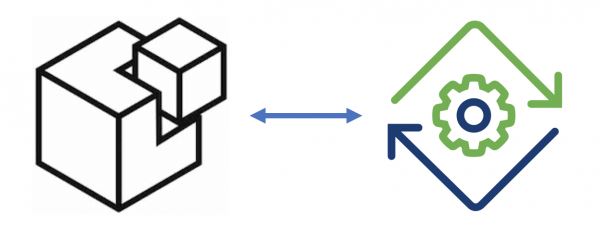

# 通过收购SaltStack提升VMware的云自动化能力
> September 29, 2020

有兴趣的同学可以对照看 [英文原文](https://blogs.vmware.com/management/2020/09/saltandvra.html) 。

## 对本次收购背景的说明
今天的云产业是由多样性定义的：比以往任何时候都有更多的基础设施和应用程序选项、更多的云服务以及更多的管理和运营工具。但对于那些能够加速其多云战略的公司来说，回报是巨大的。多云现在是一个战略优势。在任何云上构建和部署的能力，利用每一个云进行产品灵活创新，同时从数据中心到云再到边缘安全高效地运行，这些都定义了下一代云产业。

云自动化是任何成功的云战略的基石。它使云计算更快、更简单，而且在许多方面更安全。它帮助客户跨云工作，同时最小化复杂性、风险和低效性。这就是为什么VMware vRealize经历了大规模的采用，并受到业界观察者的高度评价。企业认识到端到端基础设施自动化的好处，但我们也看到了将自动化从基础设施扩展到应用程序的价值。这就是为什么今天我们兴奋地宣布VMware将收购SaltStack，以显著扩展其软件配置管理、基础架构和网络自动化功能。

## VMware+SaltStack的价值集成
一旦完成收购，SaltStack将帮助我们完成我们的自动化故事，使我们能够将我们的自动化能力从基础设施扩展到整个应用程序堆栈。这将包括虚拟机和容器中的软件和包。这些软件配置管理功能将帮助我们满足客户的全方位自动化需求，并进一步增强客户使用VMware vRealize automation在本地和云中自动部署和配置基础架构平台的能力。此外，SaltStack还提供了强大的配置遵从性和漏洞管理功能，这将使VMware vRealize能够帮助客户解决其安全操作实践问题。

我们围绕云消费和可编程资源调配的理念是为客户提供尽可能多的选择。如今，VMware vRealize支持Puppet、Ansible和Terraform。我们致力于支持这些整合。我们还相信，许多vRealize客户将受益于具有集成配置管理的端到端自动化解决方案，我们打算在SaltStack收购结束后提供该解决方案。

SaltStack首席执行官Marc Chenn与我们分享了他对VMware和SaltStack结合的看法：“过去8年来，SaltStack一直在不懈地努力构建智能、可扩展和经得起未来考验的自动化解决方案，帮助企业控制和保护其IT基础架构。随着VMware为多云未来铺平道路，自动化的跨云协调和配置管理将成为多云战略优势不可或缺的一部分。VMware和SaltStack一起，将为云创新的未来奠定更坚实的基础，从今天这个激动人心的公告开始。

## 对继续支持SaltStack社区发展的承诺
SaltStack的产品是建立在流行和健康的开源项目的基础上的。这是SaltStack最引人注目的方面之一。VMware认为，开源软件有望加快上市时间，扩大创新渠道，提高开发人员的生产效率。开源推动创新。VMware投资于开放源代码，为其做出贡献，并在其基础上构建—这样客户就可以放心地部署更具创新性、互操作性、可扩展性和安全性的解决方案。VMware承诺在项目结束后继续SaltStack的工作，在SaltStack社区领导层的帮助下，VMware将支持并投资以帮助社区的发展。

VMware对此次收购将为客户和合作伙伴创造的机会感到兴奋，我们期待着欢迎Marc、Tom Hatch和SaltStack团队加入VMware。

> 本文作者为Ajay Singh，是VMware云管理业务部门的高级副总裁兼总经理
