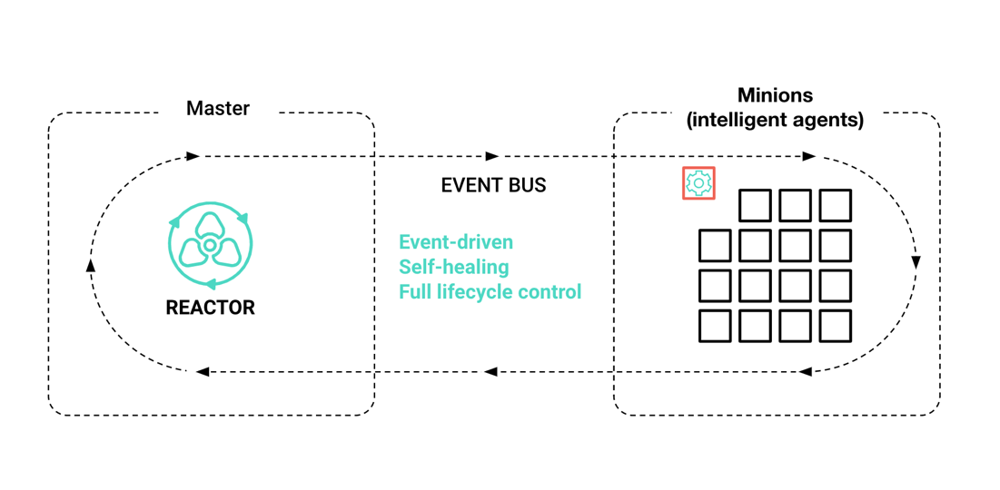

# VMware vRealize Automation为SaltStack提供了本地化的配置管理功能支持
> November 5, 2020  Kendall Lovett

有兴趣的同学可以对照看 [英文原文](https://blogs.vmware.com/management/2020/11/vmware-vrealize-automation-saltstack-config-launch.html) 。

> 一点背景知识：vRealiz 是一个真正的企业级云计算管理平台。在服务器、网络、存储这些物理架构之上，由 vSphere 来提供计算虚拟化、NSX 来提供网络虚拟化、VSAN 来提供存储虚拟化。vRealize 可提供完整体系可见性，以及持续性能优化、高效容量和成本规划及管理、应用感知型智能修复和集成式合规性。vRealize 支持以本地部署产品和 SaaS 的形式提供。

今天，我们非常高兴地宣布VMware vRealize Automation SaltStack Config作为VMware vRealize Automation中的配置管理组件正式上市。使用vRealize Automation 8.2高级版和企业版（包括作为vRealize套件和vCloud套件的一部分）的客户现在可以访问这个强大的工具，并开始在其on-prem、cloud或混合环境中自动化软件配置管理任务。

此版本的vRealize automation由Salt（一个强大的开源自动化引擎）提供支持，是自2020年10月收购SaltStack以来，VMware提供的第一个集成Salt功能的产品。

## 基于Salt的配置管理功能，在vRealize Automation中提供本地化支持
此版本将配置管理建立为vRealize自动化的本地化产品。它将补充vRealize自动化产品中集成的现有专门用于软件构建的自动化服务，以解决广泛的客户用例，包括自助混合云、DevOps for Infrastructure、Kubernetes自动化和网络自动化。

vRealize Automation SaltStack Config将跨应用程序和基础架构的事件驱动配置自动化作为一个新的功能用例添加，并通过集成到自助式IaaS消费层、策略和治理以及强大的DevOps功能（如代码、基础架构管道和GitOps等基础架构）扩展现有用例。

## vRealize Automation SaltStack Config的关键功能
vRealize Automation现在提供了一组强大的动态企业级配置管理功能和内容，允许您立即交付结果。

## 简单的、对用户友好的声明式IaC控件

vRealize Automation SaltStack Config是基于Python的，通过直观的声明性管理框架和简单易读的YAML扩展了vRealize自动化功能。不需要学习DSL或是弄乱繁琐的编码语言，就可以实现Infrastructure as Code的管理功能。

## 灵活的多云环境控制选项
无论您是在云迁移过程中，严格地在prem上，还是完全部署在容器上，vRealize Automation现在都允许您抽象地控制底层基础设施，这样您就可以一次性构建所需的配置，并在整个数据中心和多云环境中实施它。此外，vRealize Automation SaltStack Config采用高度可扩展的体系结构构建，并以智能minions为基础，通过API或SSH方法作为系统代理或无代理运行。

## 自动自愈
正确配置关键系统以提高可靠性和优化资源利用率。vRealize Automation SaltStack Config构建在事件驱动的自动化引擎上，使vRealize Automation成为唯一的基础设施自动化平台，可以立即检测配置漂移、系统错误或第三方通知等事件，并自动执行所需状态等响应。它还可以管理复杂的编排，如多步骤的系统修补和重新启动、跨应用程序工作流，甚至业务流程，如更新ITSM、CMDB或其他记录系统。

## 由Salt开源项目提供支持
依托于一个充满活力和活跃的开放源码社区，Salt开放源码软件正在不断地推动创新的边界。作为vRealize automation SaltStack Config引擎下的自动化引擎，用户可以利用Salt的全部功能以及vRealize automation的企业级基础设施自动化功能。

## 快速、强大的大规模远程执行
vRealize Automation SaltStack Config超越了基本的配置管理，它有一个本机远程执行引擎，能够在超规模的系统中执行闪电般快速的更改。

随着vRealize Automation SaltStack配置功能的增加，vRealize Automation正在为我们的客户扩展其强大而现代化的基础设施自动化平台。虽然这是重要的第一步，但我们对未来的vRealize自动化功能感到兴奋，它将利用Salt技术提供新的、现代的和创新的基础设施自动化和安全操作用例。

